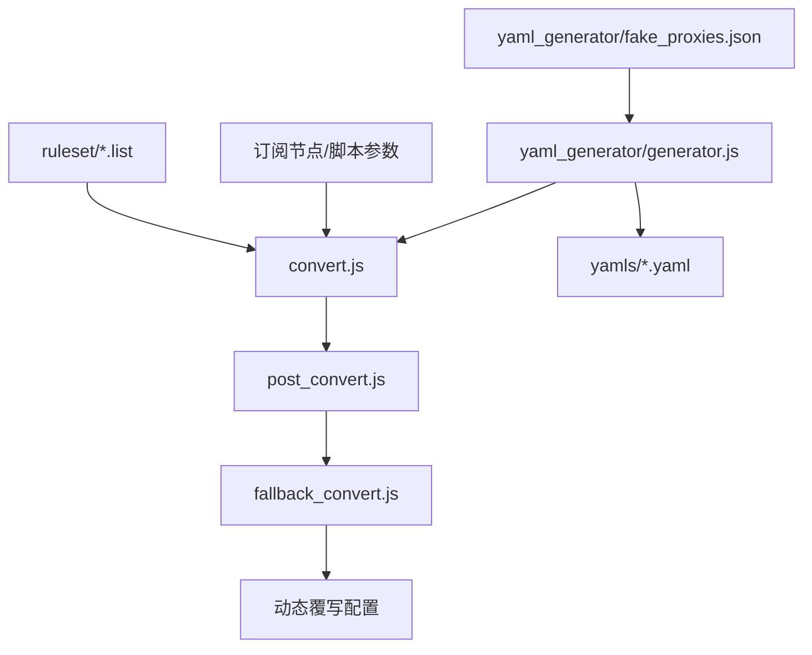
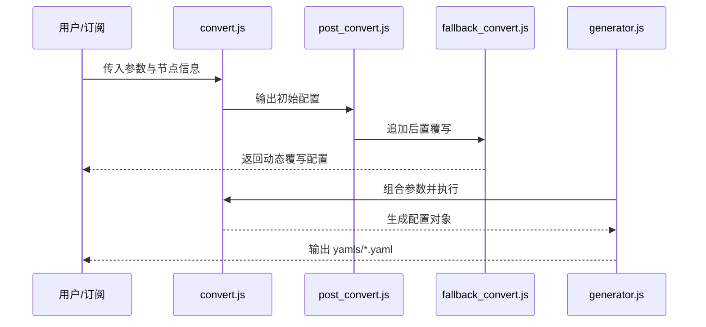

# 架构设计

## 总体架构

## 技术栈
- **脚本:** Node.js（CommonJS）
- **数据:** 纯文件形式（规则列表、JSON、YAML）

## 核心流程

## 重大架构决策
完整的 ADR 存储在各变更的 how.md 中，本章节提供索引。

| adr_id | title | date | status | affected_modules | details |
|--------|-------|------|--------|------------------|---------|
| ADR-000 | 暂无重大架构决策 | 2026-01-03 | ✅已采纳 | - | - |
